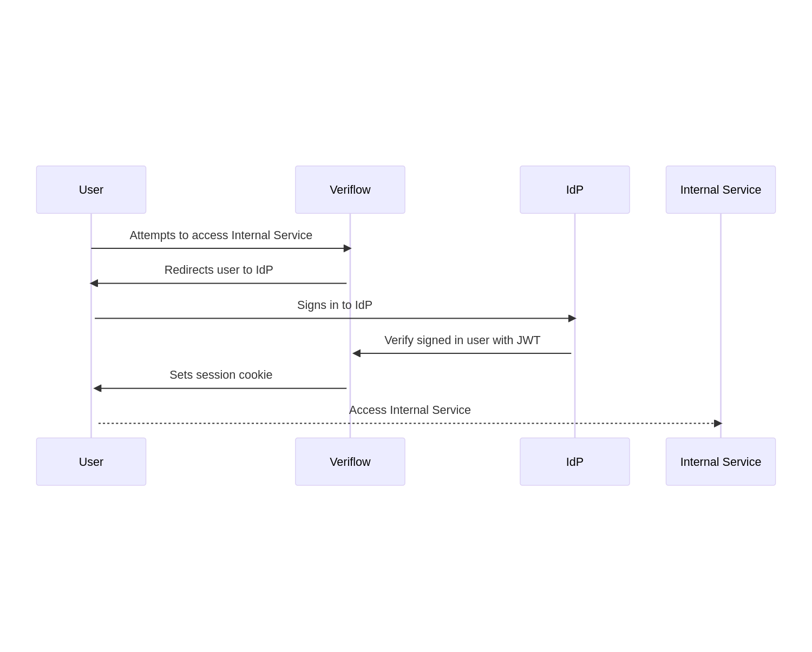

<a name="readme-top"></a>

<div align="center">

<h3 align="center">Veriflow Access Proxy</h3>

  <p align="center">
    Veriflow serves as a user-context-aware Access proxy, enabling secure control of internal services and infrastructure. 
    <br />
    <br />
    <a href="https://github.com/rorylshanks/veriflow/issues">Report Bug</a>
    ·
    <a href="https://github.com/rorylshanks/veriflow/issues">Request Feature</a>
  </p>
</div>

<!-- ABOUT THE PROJECT -->
## About The Project

Veriflow is an innovative, context-sensitive access management solution developed as a competitive alternative to existing options such as Pomerium. Born out of a need for enhanced, versatile, and user-friendly access control, Veriflow excels in providing secure, streamlined, and comprehensive management of internal services and infrastructure across all hosting environments. 

Three key reasons make Veriflow stand out:

1. **Context-Aware Security**: Veriflow's context-aware gateway functionality takes security to the next level by adapting to various internal service and infrastructure environments, thereby providing robust, intelligent, and reliable access control.

2. **Adaptable & Scalable**: Whether your infrastructure is hosted on-premise, in the cloud, or a combination of both, Veriflow is designed to adapt to your needs, ensuring scalability and flexibility.

3. **User-Friendly Configuration**: The configuration of Veriflow is straightforward and intuitive. Each parameter is designed to be self-explanatory, making it easy for administrators to understand and manage access control, ultimately reducing complexity and saving time.

<p align="right">(<a href="#readme-top">back to top</a>)</p>

## How It Works

Veriflow acts as a reverse proxy for all requests, and sits at the ingress point of your network. When a user tries to access a service that is served by Veriflow, the below sequence will take place.



<!-- GETTING STARTED -->
## Getting Started

A prebuilt Docker container is available from Dockerhub, containing the autoscaler. You can pull the image by simply running

```
docker run -p 2080:2080 -v $(pwd)/config.yaml:/appdata/config.yaml megalan247/veriflow:latest
```

You may speficy a different configuration file location using the `CONFIG_FILE` env var

```
docker run -p 2080:2080 -e CONFIG_FILE=/etc/config.yaml -v config.yaml:/etc/config.yaml megalan247/veriflow:latest
```

## Veriflow Configuration Options

An example configuration file can be found in `example-config.yaml`. A breakdown of each option is below

- `auth_listen_port`: Port on which the authentication server listens.
- `data_listen_port`: Port on which the data server listens.
- `service_url`: URL of the Veriflow service.
- `cookie_secret`: Secret key used for cookie encryption and verification.
- `redis_host`: Hostname of the Redis database server.
- `redis_port`: Port of the Redis database server.
- `idp_client_id`: Client ID for communication with the Identity Provider (IdP).
- `idp_client_secret`: Secret key for authenticating with the Identity Provider (IdP).
- `idp_tenant_id`: Identifier for the specific tenant in the Identity Provider's system.
- `idp_provider`: Identity Provider system. Currently only support Microsoft Graph
- `idp_provider_scope`: Authorization scopes for the Identity Provider.
- `idp_provider_user_id_claim`: Claim used to identify the user in the Identity Provider.
- `idp_provider_url`: URL of the Identity Provider service.
- `idp_refresh_directory_interval`: How often the directory information should be refreshed from the Identity Provider.
- `idp_refresh_directory_timeout`: How long the system should wait for a directory refresh before timing out.
- `metrics_address`: Address and port where the metrics server should listen.
- `signing_key`: RSA private key for signing JWT tokens, encoded in base64.
- `redirect_base_path`: Base path for redirection URLs. By default `/.veriflow`
- `jwks_path`: Location of the JSON Web Key Set (JWKS) that can be called to get the public keys of the signing key.
- `policy`: Policy for access control. This includes:
    - `title`: Title of the policy.
    - `from`: Source URL.
    - `to`: Destination URL.
    - `claims_headers`: Headers to include in the JWT claims.
    - `allowed_groups`: Groups allowed access.
    - `cors_allow_preflight`: Whether to allow preflight CORS requests (HTTP `OPTIONS` requests).
    - `remove_request_headers`: Headers to remove from the request.
    - `set_request_headers`: Headers to set for the request.
    - `token_auth_config_file`: The location of the external JSON file containing the token definitions (e.g., `"token-auth.json"`).
    - `token_auth_header`: The name of the HTTP header that should contain the token (e.g., `Authorization`).
    - `token_auth_header_prefix`: The prefix that should be present before the token in the HTTP header (e.g., `"Basic "`).
    - `token_auth_is_base64_encoded`: Boolean value indicating whether the token is Base64 encoded (`true` or `false`).
    - `request_header_map_file`: This parameter specifies the location of the external JSON file containing the header definitions for per-user request header mapping (e.g., `request_header_map.json`).
    - `request_header_map_headers`: This is a list of the names of the HTTP headers that should be set for the requests for per-user request header mapping
## Token Authentication in Veriflow

In Veriflow, the token authentication functionality provides an alternative to the typical Single Sign-On (SSO) flow. It uses externally defined tokens for authorizing users and facilitating programmatic access. The token auth is configured at two places.

### Per-Policy Configuration

Within the policy configuration, several parameters can be set. See above for the token_auth parameters

### External Token Authentication

The JSON file specified in `token_auth_config_file` should contain an object for each token, structured as follows:

```json
{
    "TOKEN": {
        "userId": "userId",
        "valid_domains": [
            "**"
        ]
    }
}
```

In this object:

- `"TOKEN"` is the token used for authorization.
- `"userId"` is the ID of the user to whom the token belongs.
- `"valid_domains"` is an array of domain patterns where the token is valid. Patterns can be globbed using the [Picomatch](https://github.com/micromatch/picomatch) library. These patterns should match the `from:` section in the route configuration of the policy. The `"**"` pattern signifies that the token is valid on all domains.

Please note, for security purposes, it is essential to keep the JSON file and the policy configuration secure and confidential, as they contain sensitive access information.

### Request Header Mapping

The Request Header Mapping is a powerful functionality in Veriflow that allows administrators to set specific request headers per user, per route. This feature enhances flexibility by providing a more granular approach to managing requests. For per-route options, please see the above route definition.

The JSON file specified in `request_header_map_file` should contain an object for each user, structured as follows:

```json
{
    "ENTER_USER_ID_HERE": {
        "Authorization": "test",
        "X-test-Header": "another test"
    }
}
```

In this object:

- `"ENTER_USER_ID_HERE"` should be replaced with the ID of the user for whom you're setting the headers.
- The key-value pairs inside the user's object correspond to the headers you wish to set, with the header name as the key and the header value as the value.

Upon configuration, Veriflow will automatically add the requested headers to each upstream request based on the user that accesses the service. This allows for personalized and context-specific request handling. Please remember to keep your JSON file and the policy configuration secure due to the sensitive nature of header information.

## Roadmap

- [ ] Add device-aware context
- [ ] Add UI for debugging users
- [ ] Fix getRouteForHostname to also match based on path
- [ ] Add metrics for monitoring
- [ ] Better logging

See the [open issues](https://github.com/rorylshanks/veriflow/issues) for a full list of proposed features (and known issues).

<p align="right">(<a href="#readme-top">back to top</a>)</p>


<!-- CONTRIBUTING -->
## Contributing

Contributions are what make the open source community such an amazing place to learn, inspire, and create. Any contributions you make are **greatly appreciated**.

If you have a suggestion that would make this better, please fork the repo and create a pull request. You can also simply open an issue with the tag "enhancement".
Don't forget to give the project a star! Thanks again!

1. Fork the Project
2. Create your Feature Branch (`git checkout -b feature/AmazingFeature`)
3. Commit your Changes (`git commit -m 'Add some AmazingFeature'`)
4. Push to the Branch (`git push origin feature/AmazingFeature`)
5. Open a Pull Request

<p align="right">(<a href="#readme-top">back to top</a>)</p>


<!-- LICENSE -->
## License

Distributed under the GPLv3 License. See `LICENSE` for more information.

<p align="right">(<a href="#readme-top">back to top</a>)</p>
